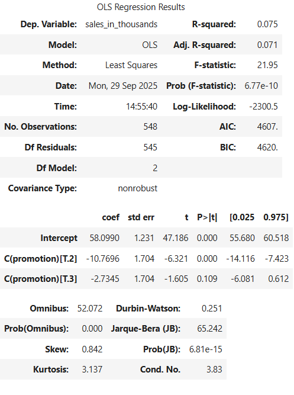

# 📊 Fast-Food Promotions Sales Analysis

    

**Quick Insight:** Promotion 1 and 3 outperform Promotion 2 based on 4 weeks of sales data.  

**Key Methods:** Exploratory Data Analysis, OLS Regression, Residual Diagnostics, ANOVA, and Tukey HSD.  

---

## Table of Contents
1. [Project Overview](#project-overview)  
2. [Dataset](#dataset)  
3. [Scenario & Goal](#scenario--goal)  
4. [Exploratory Data Analysis (EDA)](#exploratory-data-analysis-eda)  
5. [OLS Regression](#ols-regression)  
6. [Residual Diagnostics](#residual-diagnostics)  
7. [ANOVA & Post-hoc Testing](#anova--post-hoc-testing)  
8. [Visualization of Results](#visualization-of-results)  
9. [Business Recommendation](#business-recommendation)  

---

## Project Overview
**Problem:** The fast-food chain wants to launch a new menu item but is unsure which of three marketing campaigns will maximize sales.  

**Goal:** Evaluate the A/B testing results to determine which promotion is most effective.  

**Target Variable:** `SalesInThousands` – weekly sales of the new menu item per store.  

**Business Impact:** Identifying the most effective promotion helps the chain allocate marketing resources efficiently, increasing sales and minimizing the cost of ineffective campaigns.

---

## Dataset

**Source:** [Kaggle – Fast Food Marketing Campaign AB Test](https://www.kaggle.com/datasets/chebotinaa/fast-food-marketing-campaign-ab-test?resource=download)  

**Scenario:**  
A fast-food chain plans to add a new menu item and is testing three marketing campaigns to determine which drives the highest sales. The item was introduced at stores in randomly selected markets, with a different promotion at each location. Weekly sales were recorded for the first four weeks.  

**Goal:**  
Evaluate A/B testing results and decide which promotion is most effective.  

**Shape:** 4 weeks × *n* stores × 7 columns  

**Columns / Feature Types:**  
- **MarketID** (Categorical): Unique identifier for each market  
- **MarketSize** (Categorical): Size of market area by sales  
- **LocationID** (Categorical): Unique identifier for each store  
- **AgeOfStore** (Numerical): Age of store in years  
- **Promotion** (Categorical): One of three promotions tested  
- **week** (Categorical / Numerical): Week number (1–4) when promotion ran  
- **SalesInThousands** (Numerical): Sales amount for a specific LocationID, Promotion, and week  

**Key Features:**  
- **Promotion** – main variable for analysis  
- **SalesInThousands** – target variable  
- **MarketSize & AgeOfStore** – additional factors affecting sales

---

## Scenario & Goal
A fast-food chain ran multiple promotions and collected weekly sales data. The dataset contains **4 weeks of data across multiple stores**, providing a snapshot of promotion performance.  
The goal is to identify the most effective promotion to guide business decisions.

---

## Exploratory Data Analysis (EDA)

**Key Plots:**  

**Weekly Sales by Promotion (Lineplot):**  

**Sales by Promotion and Market Size (Boxplot):**  

**Sales vs Store Age (Scatterplot):**  

> Note: Only 4 weeks of data are available, so results reflect short-term trends.

---

## OLS Regression
- Fitted an OLS model with promotion as a categorical variable.  
- Regression summary includes coefficients, p-values, and R².  

**OLS Regression Results:**  

---

## Residual Diagnostics

**Checks performed:**  
- Residuals approximately normal.  

- Q-Q plot → visual confirmation of normality.  

- Residuals vs fitted values with horizontal 0 line → homoscedasticity.  

✅ Conclusion: No major assumption violations; OLS results are valid.  

---

## ANOVA & Post-hoc Testing
- ANOVA confirms overall differences between promotions.  
- Tukey HSD identifies which promotions differ significantly.  

**Tukey HSD Summary Table:**  

✅ Conclusion: Promotions 1 and 3 perform similarly; Promotion 2 underperforms.

---

## Visualization of Results
- Barplot of mean sales with 95% confidence intervals highlights differences between promotions.  

---

## Business Recommendation
- **Promotion 1 and 3** perform similarly.  
- **Promotion 2** underperforms.  
- Recommendation: Focus on Promotions 1 and 3 for future campaigns.

